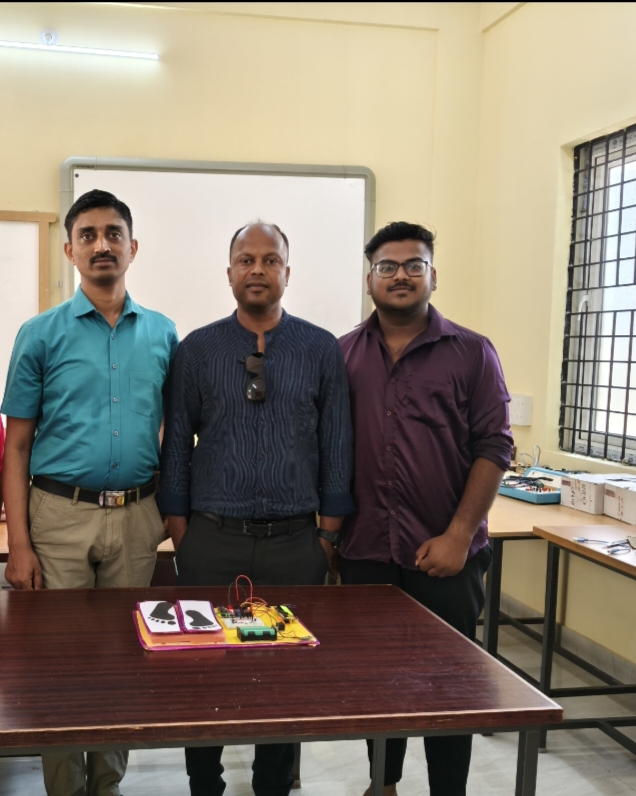
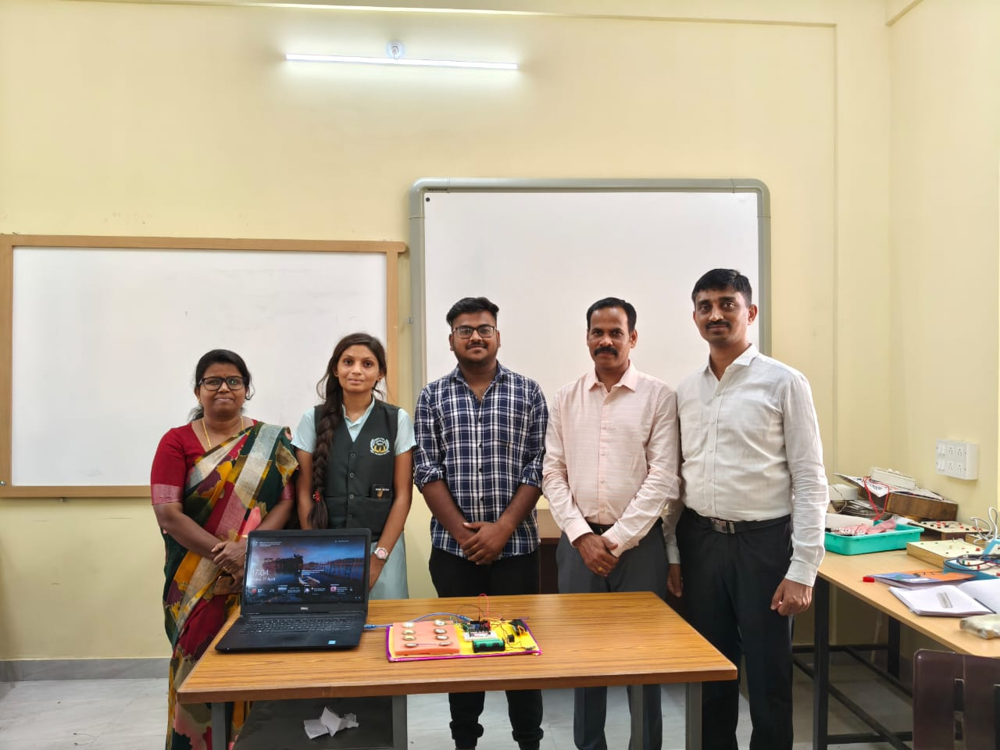

# Footstep Power Generation

## Overview
This project generates electrical energy from human footsteps using pressure-based mechanisms.

## Objective
To demonstrate renewable energy generation using mechanical pressure and energy conversion principles.

## Technologies / Components Used
- Piezoelectric Sensors
- Battery
- LEDs
- Connecting Wires
- Pressure Mechanism

## Features
- Converts foot pressure into electrical energy
- Demonstrates renewable energy concepts
- Low-cost prototype model

## Applications
- Railway Stations
- Footpaths
- Public Places
- Smart Cities

## Project Status
Academic Mini Project
## Project Preview

### Prototype Model

### Working Demo

### Output Testing

